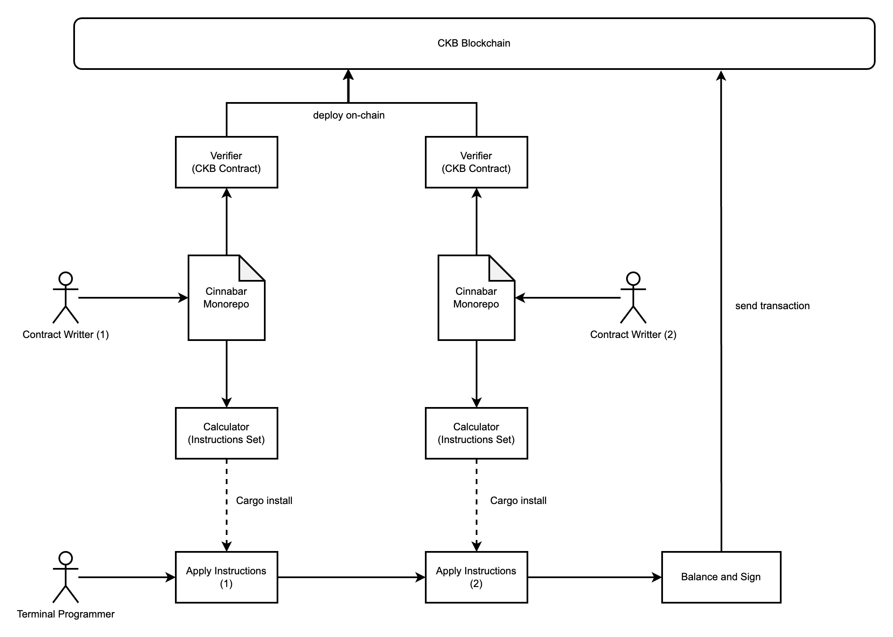
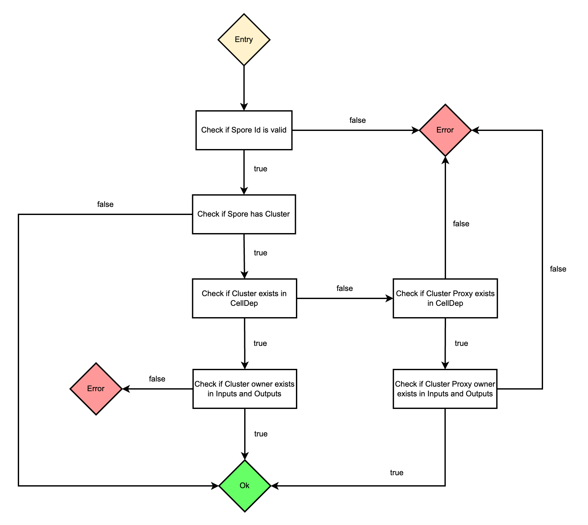

# Cinnabar

> A bright red mineral consisting of mercury sulfide. It is the only important ore of mercury and is sometimes used as a pigment.

Cinnabar is a framework that aims to find a most reasonable way to bring CKB a better programming experience.

In a short, Cinnabar takes advantage of `Calculate` and `Verify` separation design, which is the core concept of CKB Cell model, to fill in the missing parts of existing CKB programming. 

## Background

### The Counter-intuitive of CKB

In contrast of Account model based block chains, like Ethereum and Solana, `Calculate` and `Verify` are fully on-chain implemented and not separated, thus the contract takes the responsibility of processing calculation and verification logic simultanously, because of that, the transaction, which can be recognized as the contract trigger, is so simple that only contains several commands or intentions.

However, CKB is an UTXO based block chain, which `Calculate` and `Verify` are separated here, and only put `Verify` part on-chain, so the contract only takes the responsibility of verification but throws the responsibility of calculation out off-chain. For most programmers, this is counterintuitive.

For above reason, transaction of CKB has high cognitive cost, it's not as simple as a container of multiple commands or intentions, but the `RESULT` of off-chain calculation, this is the core barrier for most programmers to understand CKB programming. 

### Turn Counter-intuitive into Intuitive

CKB contracts act as a role of on-chain verifier to verify the result of off-chain calculation, which is the transaction, but the responsibility of assembling transaction misses its taker, in most cases, this responsiblity unreasonably gives to the terminal programmers.

Terminal programmers are not only programmers, but more importantly our customers, they should be given the least burden and take the best experience. In a most reasonable way, the responsibility of transaction assembly should be given to contract writters, just like those from Ethereum and Solana.

However, like Bitcoin UTXO model, the advanced CKB Cell model allows a transaction to have maximum flexibility and composability, but in contrast, the contract writters only define minimum operating conditions about successfully running a transaction. So considering this paradox, we need to intruduce a transaction assembly framework that splits composability into pieces.

### Simplicity

Current toolchains and SDKs in CKB ecosystem lack simplicity, for instance, writting and deploying CKB contracts are always challenging for most newcommers, and it's a nightmare testing contracts as well.

## Modules in Cinnabar 

Cinnabar framework provides `Calculate` module and `Verify` module, in addition, contract deployment related commands are also integrated, known as `Deployment` module.

### Calculate Module

CKB transaction contains few fields, they are:
- CellDeps
- HeaderDeps
- Inputs
- Outputs
- Witnesses

The calculation is to assembly transaction with a set of instructions about fulfilling fields with proper data, for example, a typical calculation instruction comes up with the input and output, filling into `Inputs` and `Outputs` fields respectively.

A transaction can contain multiple instructions, like creating Spore DOBs or transfering xUDT assets, they are totally settled by a batch of transaction fields fullfill operations. So, a complete process of transaction assembly can be parsed into below format:

* Transaction calculation
  * Instruction 1: create one Spore DOB asset for user A
    * Operation 1: add an existing cell owned by user A into "Inputs" field
    * Operation 2: add a Spore DOB cell into "Outputs" field
    * Operation 3: add the existing Spore Cluster cell into "Inputs" and "Outputs" fields
    * Operation 4: add Spore and Cluster contract cells into "CellDeps" field
  * Instruction 2: transfer xUDT asset from user A to user B
    * Operation 1: add an existing xUDT cells from user A into "Inputs" field
    * Operation 2: add a xUDT cell of user B into "Outputs" field
    * Operation 3: add xUDT contract cell into "CellDeps" field
  * Instruction 3: balance transaction
    * Operation 1: add existing cells of user A into "Inputs" field
    * Operation 2: add change cell of user A into "Outputs" field
  * Instruction 4: sign transaction
    * Operation 1: sign transaction with user A
    * Operation 2: put signature into "Witnesses" field

As shown above, the calculation of a transaction is a set of instructions, and an instruction is a set of operations, finally, an operation indicates how to fullfill transaciton's fields.

Contract writters should provide instructions to cover up their contracts assembly requirement details for terminal programmers, and no need to worry about the next, because the responsibility of composing instructions to generate transaction is for those terminal programmers.

A diagram of Calculate module design:



Run [tranfer](examples/secp256k1_transfer.rs) example:
```bash
$ cargo run --example secp256k1_transfer ckt1qzda0cr08m85hc8jlnfp3zer7xulejywt49kt2rr0vthywaa50xwsqfqmf4hphl9jkrw3934mwe6m3a2nx88rzgdlw820 ckt1qzda0cr08m85hc8jlnfp3zer7xulejywt49kt2rr0vthywaa50xwsqtz32u8mgzk57zdtt6n62z4y2zyh8egkdcahyxk3 1000.0 <secret_key>

# if no <secret_key> provided, then need `ckb-cli` to be installed
```

> note: Instruction can be compared to the interface provided by contracts from those Account model based block chains.

## Verify Module

Writting a contract is to verify wether the structure of a transaction is valid, generally speaking, this isn't difficult, but when the transaction structure becoming complex, contract code might be bloated.

If contract writters want to better manage their scripts code, modulization is essential and cannot be ignored. Here would introduce a practical modulization method from Cinnabar, it's called the `Verification Tree`.

Verification tree needs to split a whole verification process into multiple small pieces, and then manage them in a tree structure, working like a flowchart.

For example, a simplified version of flowchart for verifying a Spore creation transaction:



Each flowchart node on diagram can be treated as a tree node from verification tree:

```rust
#![no_main]
#![no_std]

use ckb_cinnabar_verifier::{
    cinnabar_main, define_errors, Result, Verification, CUSTOM_ERROR_START, TREE_ROOT
};
use ckb_std::debug;

define_errors!(
    SporeError,
    {
        InvalidSporeId = CUSTOM_ERROR_START 
        NoClusterOwnerExists,
        NoClusterProxyExists,
        NoClusterProxyOwnerExists,
    }
);

#[derive(Default)]
struct Context {
    // ...
}

#[derive(Default)]
struct CheckSporeId {}

impl Verification<Context> for CheckSporeId {
    fn verify(&mut self, name: &str, ctx: &mut Context) -> Result<Option<&str>> {
        debug!("verify: {name}");
        // ...
        // if spore id is valid
        Ok(Some("check_cluster"))
        // else
        Err(SporeError::InvalidSporeId)
    }
}

#[derive(Default)]
struct CheckCluster {}

impl Verification<Context> for CheckCluster {
    fn verify(&mut self, name: &str, ctx: &mut Context) -> Result<Option<&str>> {
        debug!("verify: {name}");
        // ...
        // if no cluster
        Ok(None)
        // if cluster not exists in CellDep
        Ok(Some("check_proxy"))
        // if cluster owner exists in Inputs and Outputs
        Ok(None)
        // else
        Err(SporeError::NoClusterOwnerExists)
    }
}

#[derive(Default)]
struct CheckClusterProxy {}

impl Verification<Context> for CheckClusterProxy {
    fn verify(&mut self, name: &str, ctx: &mut Context) -> Result<Option<&str>> {
        debug!("verify: {name}");
        // ...
        // if cluster proxy not exists in CellDep
        Err(SporeError::NoClusterProxyExists)
        // if cluster proxy owner exists in Inputs and Outputs
        Err(SporeError::NoClusterProxyOwnerExists)
        // else
        Ok(None)
    }
}

cinnabar_main!(
    Context,
    (TREE_ROOT, CheckSporeId),
    ("check_cluster", CheckCluster),
    ("check_proxy", CheckClusterProxy)
)
```

It's very easy to distinguish how a CKB contract works because of the clear modular design. 

## Deployment Module

Install Cinnabar binary:

```bash
$ git clone https://github.com/ashuralyk/ckb-cinnabar
$ cd ckb-cinnabar
$ cargo install --path .

# need to install ckb-cli to sign transaction if use Cinnabar to deploy contract
$ git clone https://github.com/nervosnetwork/ckb-cli
$ cd ckb-cli
$ cargo install --path .

# or install from https://github.com/nervosnetwork/ckb-cli/releases
```

Run help:

```bash
$ ckb-cinnabar

Usage: ckb-cinnabar [OPTIONS] <COMMAND>

Commands:
  deploy   Upload contract to CKB
  migrate  Update on-chain contract from old version to new version
  consume  Consume on-chain contract to release the capacity
  help     Print this message or the help of the given subcommand(s)

Options:
  -n, --network <NETWORK>
          CKB network, options are `mainnet`, `testnet` or URL (e.g. http://localhost:8114) [default: testnet]
      --deployment-path <DEPLOYMENT_PATH>
          Directory of the contract deployment information [default: deployment]
      --contract-path <CONTRACT_PATH>
          Directory of the compiled contract binary [default: build/release]
  -h, --help
          Print help
  -V, --version
          Print version
```

Examples:

```bash
# deploy a new compiled contract with type_id
$ ckb-cinnabar deploy --contract-name my_contract --tag v0.1.1 --payer-address ckt1qzda0cr08m85hc8jlnfp3zer7xulejywt49kt2rr0vthywaa50xwsq28phxutezqvjgfv5q38gn5kwek4m9km3cmajeqs --type-id

# upgrade an existing contract with type_id removed
$ ckb-cinnabar migrate --contract-name my_contract --from-tag v0.1.1 --to-tag v0.1.2 --type-id-mode remove

# consume an existing contract
$ ckb-cinnabar consume --contract-name my_contract --tag v0.1.2
```

> note: Comparing to Capsule, Cinnabar deployment module only uses `ckb-cli` to sign transaction without creating the `deployment.toml` file as prerequisites.

For specific usage scenarios, please refer to [ckb-cinnabar-scripts-template](https://github.com/ashuralyk/ckb-cinnabar-scripts-template) project.
